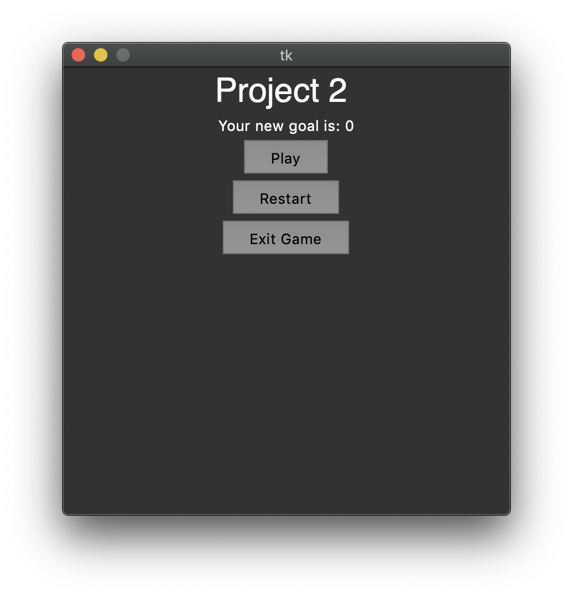
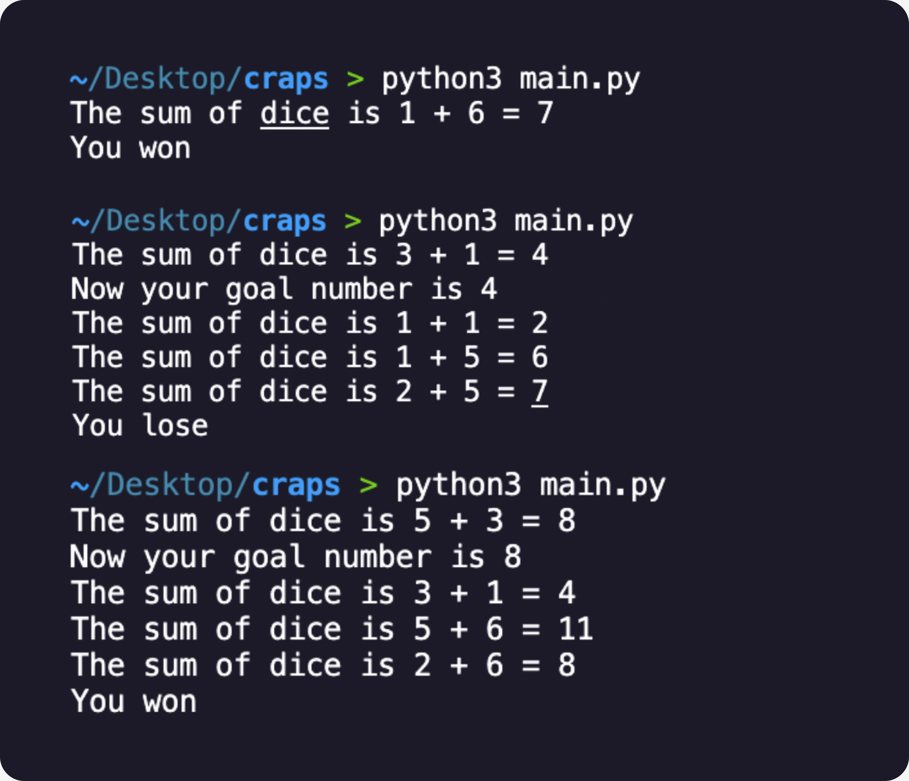

<a name="readme-top"></a>
[![LinkedIn][linkedin-shield]][linkedin-url]


<!-- PROJECT LOGO -->
<br />
<div align="center">
  <a href="https://github.com/vmkrtchy/Station-Project-2-Craps">
    
  </a>

  <h3 align="center">Station Project 2 : Craps</h3>


</div>


<!-- TABLE OF CONTENTS -->
<details>
  <summary>Table of Contents</summary>
  <ol>
    <li>
      <a href="#about-the-project">About The Project</a>
      <ul>
        <li><a href="#built-with">Built With</a></li>
      </ul>
    </li>
    <li>
      <a href="#getting-started">Getting Started</a>
      <ul>
        <li><a href="#installation">How To run</a></li>
      </ul>
    </li>
  </ol>
</details>


<!-- ABOUT THE PROJECT -->
## About The Project


Here are the rules of the game:

The player should roll two dice. If the sum of both of them is 7 or 11 the player wins. If the sum is 2, 3 or 12 (craps) the casino wins. If during the first roll the sum is 4, 5, 6, 8, 9 or 10, that number becomes the “goal” number. To win, the player should roll the dice till they roll the goal number again. If the player rolls a 7 before rolling the goal number, they lose.


Your task is to recreate this game using Python. Your program should roll two dice and output the sum of two random numbers. By following the rules of the game, your program should decide whether the player wins or loses.


Write a program on Python that does the following:


* Allows the user to pick one of the templates
* Asks the user to input words. “Type number”, for example
* Generate a story afterwards and shows it to the user

Don't bother with any additional functions for now, but make sure your program follows these 3 conditions. You will have to use the “random” library, and the only functions you’ll be able to use will be print() and input() or make your own ones. We recommend using one of the three templates provided, which will make the evaluation process easier for your peers.
<br>
<p align="right">(<a href="#readme-top">back to top</a>)</p>


### Built With
* [![Python3][Py]][Next-url]

<p align="right">(<a href="#readme-top">back to top</a>)</p>

<!-- GETTING STARTED -->
## Getting Started

This is an example of how you may give instructions on setting up your project locally.
To get a local copy up and running follow these simple example steps.

### Installation

This is an example of how to list things you need to use the software and how to install them.
* Library installation
  ```sh
  * pip3 install partial
  * pip3 install tk
  ```

### RUN

_Below is an example of how you can run it
1. Do clone
```sh
git clone https://github.com/vmkrtchy/Station-Project-2-Craps.git
```
2.cd in project Directory
```sh
cd Station-Project-2-Craps
```
3. Run in terminal
```sh
python3 main.py
```
<!-- CONTACT -->
## Contact

Vahan Mkrtchyan - [@vmkrtchy](https://www.linkedin.com/in/vmkrtchy/) - tumolabs.jacke@gmail.com

Project Link: [https://github.com/vmkrtchy/Station-Project-2-Craps](https://github.com/vmkrtchy/Station-Project-2-Craps)

<p align="right">(<a href="#readme-top">back to top</a>)</p>


<!-- MARKDOWN LINKS & IMAGES -->

[linkedin-shield]: https://img.shields.io/badge/-LinkedIn-black.svg?style=for-the-badge&logo=linkedin&colorB=555
[linkedin-url]: https://www.linkedin.com/in/vmkrtchy/


[Py]: https://cdn.iconscout.com/icon/free/png-256/python-2752092-2284909.png
[Next-url]: https://www.python.org/


